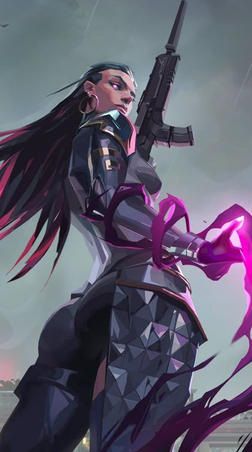

# renlovecomputer
<table style="border-collapse: collapse; border: none;">
  <tr>
    <!-- ЛЕВАЯ КОЛОНКА С ЗЕЛЕНОВАТЫМ ФОНОМ -->
    <td width="60%" valign="top" style="background-color: #0b1d16; padding: 20px; border-top-left-radius: 12px; border-bottom-left-radius: 12px; border: none;">
      <h1>Hi there, I'm ren </h1>
      

        <!-- Твои загруженные файлы ОС -->
         &nbsp;
         &nbsp;
        
      

      <blockquote>
        I want to know everything abt computers 🖥️ 
        Used to use sum linux distros like Arch and Void, but currently using Windows 11 for games.
      </blockquote>
      

      <h3>🛠️ Technologies & Languages (Learning & Improving)</h3>
      

        <!-- Твои загруженные файлы языков -->
         &nbsp;
         &nbsp;
        
      

      <ul>
        <li>🎯 <b>Main Goal:</b> To become a skilled <b>Web Developer</b></li>
        <li>💻 <b>Interests:</b> System administration, OS customization, Open Source</li>
      </ul>
      

      <h3>💻 Apps & IDEs (Software I Use)</h3>
      

        <!-- Твои загруженные файлы программ -->
         &nbsp;
         &nbsp;
        
      

      

      <h3>🎮 My Gaming Hub</h3>
      

        <code>🎯 Valorant</code> &nbsp; 
        <code>🔫 Counter-Strike 2</code> &nbsp; 
        <code>⛏️ Minecraft</code> &nbsp; 
        <code>🩸 Dead By Daylight</code>
      

    </td>
    <!-- ПРАВАЯ КОЛОНКА (БЕЗ ИЗМЕНЕНИЙ) -->
    <td width="40%" valign="top" align="center" style="background-color: #0b1d16; padding: 20px; border-top-right-radius: 12px; border-bottom-right-radius: 12px; border: none;">
      
    </td>
  </tr>
</table>
