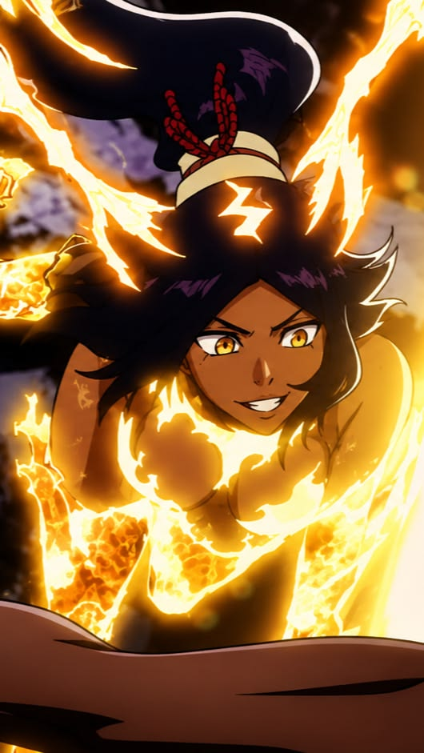

<table style="border-collapse: collapse; border: none; width: 100%;">
  <tr>
    <td width="60%" valign="top" style="background-color: #0b1d16; padding: 20px; border-top-left-radius: 12px; border-bottom-left-radius: 12px; border: none;">
      <h1>Hi there, I'm ren</h1>
      

        &nbsp;
        &nbsp;
        
        
      

      <blockquote>
        I want to know everything abt computers 🖥️ 
        Used to use sum linux distros like Arch and Void, but currently using Windows 11 for games.
      </blockquote>
      

      <h3>🛠️ Technologies & Languages (Learning & Improving)</h3>
      

        &nbsp;
        &nbsp;
        
      

      <ul>
        <li>🎯 <b>Main Goal:</b> To become a skilled 💻Web Developer</li>
        <li>💻 <b>Interests:</b> System administration, OS customization, Open Source</li>
      </ul>
      

      <h3>💻IDEs</h3>
      

        &nbsp;
        &nbsp;
              <ul>
        <li>💻 <b>IDE:</b> I love this IDEs</li>
      </ul>
      

      

                  <h3>💻 DEs (Desktop Enviroment I use)</h3>
      

        &nbsp;
        
              <ul>
        <li>🎯 <b>Main DEs:</b> Imo this is the best DEs</li>
      </ul>
      

      

                  <h3>💻 Software</h3>
      

        &nbsp;
        &nbsp;
        
              <ul>
        <li>💻 <b>Apps:</b>Very useful apps</li>
      </ul>
      

      

      <h3>🎮 My Gaming Hub</h3>
      

        <code>🔮 Valorant</code>&nbsp;
        <code>🔫 Counter-Strike 2</code>&nbsp;
        <code>⛏️ Minecraft</code>&nbsp;
        <code>🩸 Dead By Daylight</code>
      

    </td>
    <td width="40%" valign="top" align="center" style="background-color: #0b1d16; padding: 20px; border-top-right-radius: 12px; border-bottom-right-radius: 12px; border: none;">
      
    </td>
  </tr>
</table>
